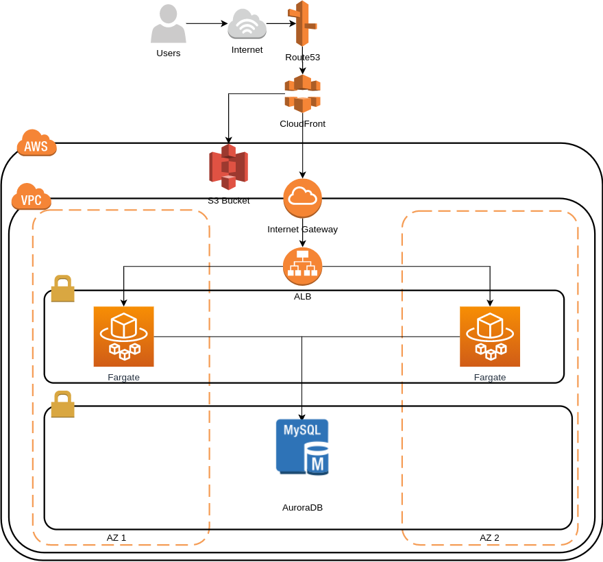

# Kavak Moodle Test

## Requirements
Implement the e-learning web tool "Moodle" using an automated deploy process. Deployment must include:
- The main tool
- All required dependencies needed by the tool
- Domain names
- SSL Certificates for an HTTPS access

## Conditions
1. Deploy must minimize user interaction (Single click deployment)
2. Deployment must minimize as much as posible dependencies with other tools (frameworks, plugins, etc)

## Solution Design
Since Moodle requires a PHP server, a LA~~M~~P stack should be enough. Moodle requires an RDBS to store content as well as a filesystem to store uploaded files from users.

The database should not be accessible from the internet but must have communictation from the web server.

Files could be stored on the server however this is not a viable nor scalable solution since high availability would require to replicate uploaded files.

### Architecture

The configuration for this solution includes the following resources:

- Route53 to enable custom domain names resolution
- CloudFront to access static content and web servers
- S3 Bucket to store user uploaded files. Requires a redirect on the Apache config
- A VPC
- Two private subnets for the instances and RDS cluster
- Internet Gateway to provide external communications
- Application Load Balancer to distribute requests among all instances
- RDS MySQL to persist content

### Moodle Hardware Requirements
- Disk space: 200MB for the Moodle code, plus as much as you need to store content. 5GB is probably a realistic minimum.
- Processor: 1GHz (min), 2GHz dual core or more recommended.
- Memory: 512MB (min), 1GB or more is recommended. 8GB plus is likely on a large production server
- Consider separate servers for the web "front ends" and the database. It is much easier to "tune"

Obtained from the [Installation Moodle docs](https://docs.moodle.org/39/en/Installing_Moodle#Requirements)
